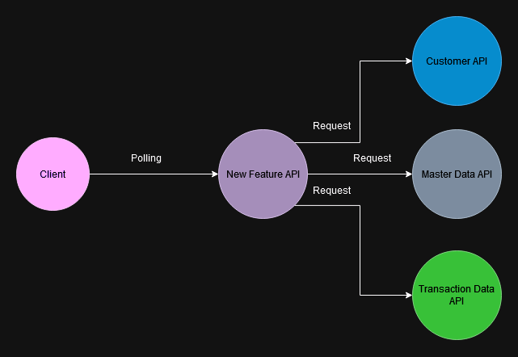

# H LAB Full Stack Pre-Assessment

## Back-end Questions

### 1. Assuming the system currently has three microservices: Customer API, Master Data API, and Transaction Data API, there is a new feature that requires data from all three microservices to be displayed in near real-time. The current technology stack includes REST APIs and an RDBMS database. How would you design a new API for this feature?

โจทย์ของ REST API ใหม่ นี้คือการแสดงข้อมูลจาก 3 microservices คือ Customer API, Master Data API และ Transaction Data API โดยที่ข้อมูลจะต้องแสดงในเวลาเกือบ real-time
API ใหม่นี้ผมเลยอาจจะใช้วิธีการง่าย ๆ โดยการให้ New Feature API ทำหน้าที่เป็น gateway เป็น service ตัวกลาง
โดยในฝั่งของ client อาจ request ข้อมูลมาที่ New Feature API ในรูปแบบ http polling โดยอาจจะตั้งค่าไว้ให้ polling ทุก ๆ 3 - 5 นาที ขึ้นอยู่กับว่า requirement อยากจะ update ข้อมูลทุก ๆ กี่นาที
โดยอาจจะมีการ implement rate limiting ร่วมด้วย เพื่อป้องกันกรณีที่ client ตั้งค่า polling ถี่เกินไปทำให้ server ทำงานหนักเกินไป
นอกเหนือจากนี้อาจจะมีการทำ caching ร่วมด้วย เพื่อลดการเรียกข้อมูลจาก microservices ทุกครั้ง และเพื่อลด latency ในการเรียกข้อมูล



ทั้งนี้ถ้าหากว่าวิธีการ polling นั้นสิ้นเปลืองทรัพยากรหรือยังมี latency ที่เยอะเกินไปอาจพิจารณาเป็นวิธีการอื่น ๆ เช่น push-based ซึ่งเท่าที่ผมพอจะทราบและมีประสบการณ์ก็คือตัว websocket

### 2. Assuming the team has started planning a new project, the project manager asks you for a performance test strategy plan for this release. How would you recommend proceeding to the project manager?

ก่อนเริ่มต้นวางแผน performance test ควรพูดคุยและทำความเข้าใจร่วมกันถึงประเด็นสำคัญที่ทีมกังวลเกี่ยวกับระบบที่กำลังจะ release เช่น

```
ระบบจองคิวจะมีผู้ใช้งานเป็นจำนวนมากในช่วงเวลา 07:00 - 12:00 ของวันทำการ
กังวลว่าระบบจะสามารถรองรับผู้ใช้งานเป็นจำนวนมากได้จนครบเวลาได้หรือไม่ เป็นต้น
```

เมื่อเข้าใจ concern แล้วเราจึงวางแผนทำ performance test เพื่อคลายข้อกังวลนั้น ๆ โดยการวางแผน performance test จะประกอบด้วยขั้นตอนดังนี้

1. กำหนดวัตถุประสงค์ของการทดสอบ เช่น ต้องการทราบว่าระบบจองคิวสามารถรองรับผู้ใช้งานได้จนครบเวลาไหม

2. เตรียมสภาพแวดล้อมในการทดสอบ ซึ่งโดยปกติแล้วควรจะเทียบเท่ากับ production ให้ได้มากที่สุด (system specfications, network และอื่น ๆ ที่มีผลต่อการทดสอบ)

3. จำลองสถานการณ์ในการทดสอบจากข้อมูลที่ได้ เช่น จำนวนผู้ใช้งานสูงสุดในช่วงเวลาที่เฉพาะเจาะจงโดยประมาณ และข้อมูลอื่น ๆ ที่จำเป็น ออกแบบ script สำหรับทดสอบให้ใกล้เคียงกับสถานการณ์จริง

4. กำหนดเกณฑ์การทดสอบเพื่อใช้อ้างอิงในการวิเคราะห์ผลการทดสอบว่าเป็นไปตามที่คาดหวังหรือควรจะเป็นหรือไม่

5. ถ้าหากไม่เป็นไปตามเกณฑ์ที่กำหนดไว้ก็ทำการ tuning แล้ว repeat test เดิมซ้ำไปเรื่อย ๆ จนกว่าจะได้ผลลัพธ์ที่ต้องการ

---

### 3. Design and develop two APIs using NestJS and Postgres with the following specifications:

#### 1. Create a Multilingual Product API: Develop an API that allows for the creation of products, each with attributes for name and description that support multiple languages.

#### 2. Multilingual Product Search API: Implement an API that enables searching for products by name in any language and returns results in a paginated format.

[Go to source code](./backend/task3/product-api/)

#### Validation:

Validate user input ผ่าน DTO (Data Transfer Object) โดยใช้ class-validator ในการ validate ข้อมูลที่รับเข้ามา ผ่าน validation pipe ของ NestJS และมีการกำหนดมาตรฐานให้กับ property บางตัว เช่น language code ที่ต้องอยู่ใน format ISO 639-1 (aa-zz)

ตัวอย่าง:

```ts
import {
  ArrayMinSize,
  IsArray,
  IsNotEmpty,
  IsString,
  ValidateNested
} from 'class-validator'
import { CreateProductTranslationDto } from './create-product-translation.dto'
import { Type } from 'class-transformer'

export class CreateProductDto {
  @IsString({
    message: 'sku must be a string'
  })
  @IsNotEmpty({
    message: 'sku is required'
  })
  sku: string

  @IsArray({
    message: 'translations must be an array'
  })
  @ArrayMinSize(1, {
    message: 'translations must have at least one element'
  })
  @ValidateNested({ each: true })
  @Type(() => CreateProductTranslationDto)
  translations: CreateProductTranslationDto[]
}
```

ตัวอย่างผลลัพธ์:

```json
{
  "statusCode": 400,
  "message": [
    {
      "sku": "sku must be a string"
    },
    {
      "translations": "translations must have at least one element"
    }
  ],
  "error": "Bad Request"
}
```

#### Database Design:


Approach ที่ใช้ในการเก็บ `name` และ `description` ในหลายภาษา จะใช้การแยกข้อมูล `Product` ออกเป็น 2 tables เป็นความสัมพันธ์แบบ one `product` to many `languages` ดังนี้

1. ตาราง `Product` จะเก็บข้อมูลที่เกี่ยวข้องกับ product ทั่วไป เช่น price stock เป็นต้น แต่ในกรณีนี้จะยกตัวอย่างเป็น sku

2. ตาราง `ProductTranslation` จะเก็บข้อมูลที่เกี่ยวข้องกับ product ที่เป็นภาษาต่าง ๆ โดยมี foreign key ชี้ไปที่ id ของตาราง `Product`

#### Testing Strategy:

สำหรับ Unit test จะใช้ Jest ในการทดสอบ logic ของ service layer โดยที่ไม่ต้องเชื่อมต่อกับ database จริง ๆ แต่จะใช้ mockup repository แทน
ใน test นี้จะยังไม่ได้ทำ test ของ controller layer เพราะว่าส่วนตัวผมยังไม่ค่อยเห็นภาพและยังเข้าใจการทำ unit test ไม่ดีเท่าที่ควร

ในส่วนของ Integration test อาจจะใช้เครื่องมืออื่น ๆ ที่ช่วยในการทดสอบ API ได้เช่น Postman, Insomnia หรืออื่น ๆ
ในสภาพแวดล้อมจำลองที่ใกล้เคียงกับ production

## React Questions

### 1. `useCallback` ใช้ทำอะไร

เป็น React Hook ที่ใช้สำหรับ cache function ที่สร้างเก็บไว้ใน memory โดย function ที่ถูกสร้างขึ้นภายใน `useCallback` จะไม่ถูกสร้างใหม่ทุกครั้งเมื่อ component มีการ re-render แต่จะถูกสร้างใหม่ก็ต่อเมื่อ **dependency array** มีการเปลี่ยนแปลง
โดยค่า return จาก `useCallback` จะเป็น function ที่ถูก cache ไว้

### 2. Write a unit test for the `UserProfile` React component using Jest and React Testing Library

**src/components/UserProfile.js** [(view source)](./react/task2/src/components/UserProfile.js)

```jsx
import React, { useState, useEffect } from 'react'
const UserProfile = ({ userId }) => {
  const [user, setUser] = useState(null)
  const [error, setError] = useState('')
  useEffect(() => {
    const fetchData = async () => {
      try {
        const response = await fetch(`https://api.example.com/users/${userId}`)
        if (!response.ok) {
          throw new Error('Failed to fetch user data')
        }
        const userData = await response.json()
        setUser(userData)
      } catch (err) {
        setError(err.message)
      }
    }
    fetchData()
  }, [userId])
  if (error) {
    return <div>Error: {error}</div>
  }
  if (!user) {
    return <div>Loading...</div>
  }
  return (
    <div>
      <h1>{user.name}</h1>
      <p>Email: {user.email}</p>
    </div>
  )
}
export default UserProfile
```

**src/components/UserProfile.test.js** [(view source)](./react/task2/src/components/UserProfile.test.js)

```jsx
import { describe, it, beforeEach, afterEach, jest } from '@jest/globals'
import { render, screen, waitFor } from '@testing-library/react'
import UserProfile from './UserProfile'

describe('UserProfile', () => {
  const mockupData = {
    id: 1,
    name: 'John Doe',
    email: 'john.doe@gmail.com'
  }

  beforeEach(() => {
    jest.spyOn(global, 'fetch')
  })

  afterEach(() => {
    jest.restoreAllMocks()
  })

  it('should render user data when successfully fetched user data', async () => {
    global.fetch.mockResolvedValueOnce({
      ok: true,
      json: async () => mockupData
    })
    render(<UserProfile userId={1} />)
    expect(screen.getByText('Loading...')).toBeInTheDocument()
    await waitFor(() => expect(global.fetch).toHaveBeenCalledTimes(1))
    expect(await screen.findByText(mockupData.name)).toBeInTheDocument()
    expect(
      await screen.findByText(`Email: ${mockupData.email}`)
    ).toBeInTheDocument()
  })

  it('should render error message when failed to fetch user data', async () => {
    global.fetch.mockResolvedValueOnce({
      ok: false
    })
    render(<UserProfile userId={1} />)
    expect(screen.getByText('Loading...')).toBeInTheDocument()
    await waitFor(() => expect(global.fetch).toHaveBeenCalledTimes(1))
    expect(await screen.findByText(/Error/i)).toBeInTheDocument()
  })
})
```

## Candidate Information

- Name: Tharadon Saenmart
- Email: tharadon.saenmart@gmail.com
